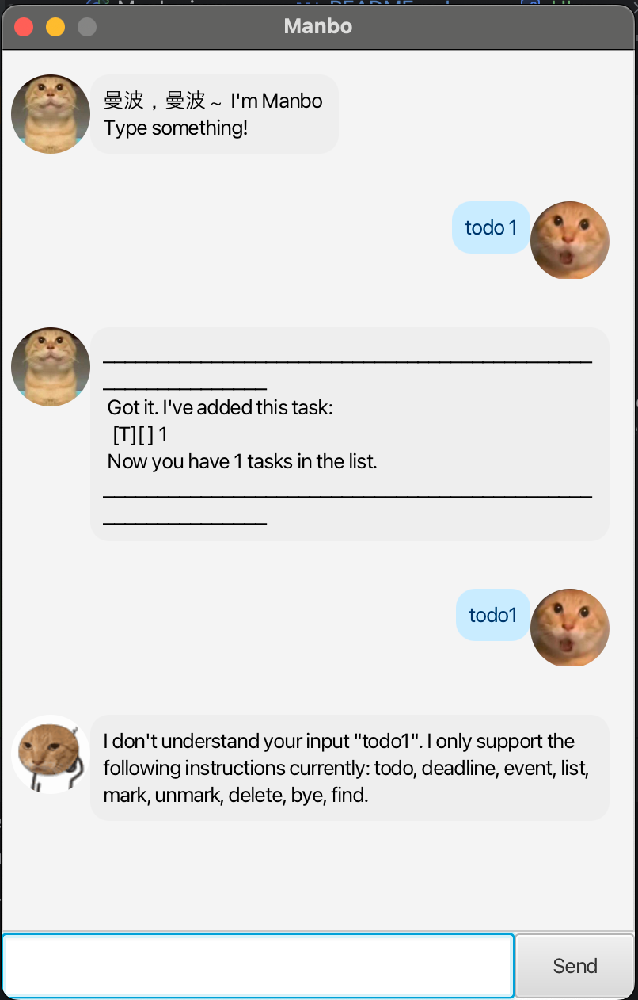

# Manbo User Guide



---

## 📖 Introduction

Welcome to **Manbo** 🎉 – your personal chatbot assistant.
Manbo helps you organize tasks, set deadlines, and manage your to-do list in a simple and intuitive way.
This guide explains all the important features and how you can use them.

---

## 🗂 Adding deadlines

Manbo allows you to add tasks with specific due dates.

**Example:**

```
deadline Submit report /by 2025-09-20
```

**Expected outcome:**

```
Got it. I've added this task:  
  [D][ ] Submit report (by: Sep 20 2025)  
Now you have 1 task in the list.  
```

---

## 📝 Adding todos

Use this when you want to add a task without a deadline.

**Example:**

```
todo Buy groceries
```

**Expected outcome:**

```
Got it. I've added this task:  
  [T][ ] Buy groceries  
Now you have 2 tasks in the list.  
```

---

## ✅ Marking tasks as done

Once you finish a task, you can mark it as done.

**Example:**

```
done 2
```

**Expected outcome:**

```
Nice! I've marked this task as done:  
  [T][X] Buy groceries  
```

---

## 📋 Listing tasks

List all current tasks to see what’s pending and what’s completed.

**Example:**

```
list
```

**Expected outcome:**

```
Here are the tasks in your list:  
1. [D][ ] Submit report (by: Sep 20 2025)  
2. [T][X] Buy groceries  
```

---

## 🗑 Deleting tasks

Remove tasks you no longer need.

**Example:**

```
delete 1
```

**Expected outcome:**

```
Noted. I've removed this task:  
  [D][ ] Submit report (by: Sep 20 2025)  
Now you have 1 task in the list.  
```

---

## 👋 Exiting Manbo

Type the command below to quit the chatbot.

**Example:**

```
bye
```

**Expected outcome:**

```
Bye. Hope to see you again soon!  
```

---

## 🎯 Summary

Manbo supports:

* Adding deadlines
* Adding todos
* Marking tasks as done
* Listing all tasks
* Deleting tasks
* Exiting the program

Start using **Manbo** today and make your task management simple and fun! 🚀

---
